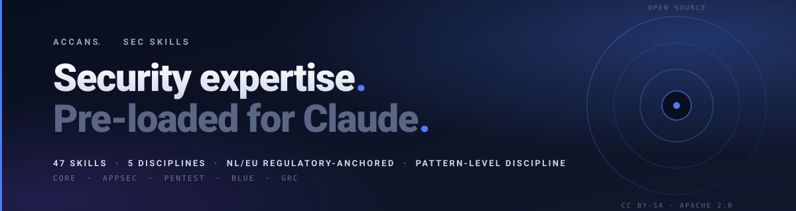
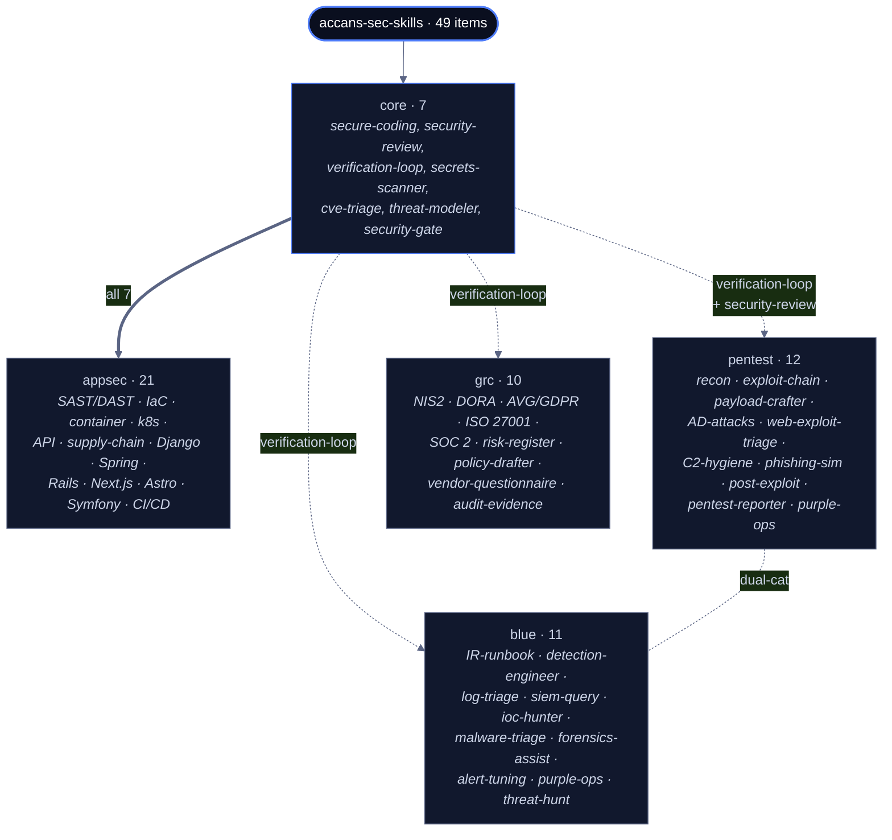
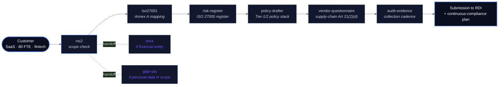

# accans-sec-skills

> **47 Claude skills, agents and commands across 5 disciplines** · ~8,600 lines of structured tradecraft · 41 ATT&CK techniques mapped · 19 ISO 27001 Annex-A controls referenced · NL/EU regulatory-anchored (NIS2, DORA, AVG/GDPR, Cyberbeveiligingswet, TIBER-NL) · 443 internal cross-references · 426 primary-source URLs · pattern-level discipline for every offensive item.

A catalog of structured `SKILL.md` files that prime Claude with security tradecraft across the full SDLC: AppSec & DevSecOps, Pentest & Red Team, Blue Team & IR, GRC & Compliance, plus a Core layer of cross-cutting essentials. Drop a profile-bundle into `~/.claude/` (or build your own selection in the browser) and Claude routes to the right item when you ask.

> *Claude knows how to think. Pre-load it with how to think about security.*

Maintained by **[Accans](https://accans.com)** — security engineering with NL/EU regulatory grounding.

---

## What this is

Five profiles, 49 items, one consistent architecture. Each item is a structured markdown file (`SKILL.md`, agent definition, or slash-command) with a front-matter description that the Claude matcher reads and a body that primes Claude on methodology, scope discipline, output format, and primary-source references.

| Profile  | Items | Focus |
|----------|-------|-------|
| `core`    | 7  | Cross-cutting essentials: secure-coding, security-review, secrets-scanner, cve-triage, threat-modeler, security-gate, verification-loop. |
| `appsec`  | 21 | Core + DevSecOps and framework-specific guardrails: SAST/DAST, IaC, container, k8s, API, supply-chain, Django, Spring, Rails, Next.js, Astro, Symfony, CI/CD. |
| `pentest` | 12 | Recon, exploit-chain, payload library, AD attack paths, web-exploit triage, C2 hygiene, phishing-sim, post-exploitation, reporter. |
| `blue`    | 11 | IR runbook, detection-engineer, log-triage (CloudTrail / Entra / Workspace / Okta), SIEM queries, IOC hunter, malware-triage, forensics-assist, alert-tuning, purple-ops, threat-hunt. |
| `grc`     | 10 | NIS2, DORA, ISO 27001, SOC 2, AVG/GDPR PIA, risk-register, policy-drafter, vendor-questionnaire, audit-evidence — EU/NL-anchored. |

`full` is everything (49).

### Profile architecture



Inheritance is asymmetric. `appsec` pulls all 7 core items (thick arrow). `pentest` pulls `verification-loop` + `security-review`. `blue` and `grc` pull only `verification-loop` — that one is the universal self-review pass that ships in every profile. `purple-ops` is dual-cat (lives in both `pentest` and `blue`); the horizontal dotted line marks the bridge. `full` is everything (49).

## How it differs from a generic "all-in-one" security AI bundle

- **Profile-based selective install.** Install `--profile blue` if you run a SOC; install `--profile pentest` for engagement work; install `--profile grc` for compliance. Don't pollute the matcher with skills that are not in your domain.
- **NL/EU regulatory anchor.** GRC items reference primary EU regulation texts (EUR-Lex), Dutch implementing law (Cyberbeveiligingswet), and Dutch authorities (Autoriteit Persoonsgegevens, Rijksinspectie Digitale Infrastructuur, DNB, AFM). Not US-centric.
- **Cross-skill graph.** 443 handoff-references between items: `secure-coding` is the substrate for `security-review`; `cve-triage` flows from `security-review`'s scan phase; `verification-loop` red-teams every output before delivery; `purple-ops` bridges pentest and blue.
- **Discipline-first.** Every pentest skill stays at pattern-level (no version-specific weaponized exploits — see *Disclaimers*). Every GRC item carries a "no legal advice" disclaimer. Every CVE / CVSS / regulatory-article reference verifies against a primary source, with `[verify]` markers where the law is currently shifting.
- **Static-site builder.** Visit a hosted instance, pick a profile or curate your own selection, and copy a `curl | bash`-pipeable install command. No browser-side magic; the site is fully static and the installer runs locally.

## Quickstart

### Hosted install (recommended)

The canonical hosted instance is at **[accans.com/skills](https://accans.com/skills)**. Pick a profile and run:

```bash
curl -sSL https://accans.com/skills/install.sh | bash -s -- --list-profiles
curl -sSL https://accans.com/skills/install.sh | bash -s -- --profile core --dry-run
curl -sSL https://accans.com/skills/install.sh | bash -s -- --profile core
curl -sSL https://accans.com/skills/install.sh | bash -s -- security-review threat-modeler ir-runbook
```

Requires `curl` and `jq` on the client. Default destination is `$HOME/.claude`; override with `--dest`. The browser-side builder at [accans.com/skills](https://accans.com/skills) lets you curate a custom selection and copy the matching install command.

### Local repo install

```bash
git clone https://github.com/roodlicht/accans-sec-skills
cd accans-sec-skills
./bin/sec-install --list-profiles
./bin/sec-install --profile core --dry-run
./bin/sec-install --profile core               # installs to ~/.claude
./bin/sec-install --profile full --dest .claude   # repo-scoped install for testing
```

## Working language

The catalog is fully English. All 49 items — across Core, AppSec, Pentest, Blue, and GRC — have English bodies, English front-matter descriptions, and English public-facing positioning (this README, examples, smoke tests, contributor docs).

**GRC items remain explicitly NL/EU-anchored** in their references and regulatory text. That is the catalog's positioning — preserved through the translation work. NIS2, DORA, AVG, Cyberbeveiligingswet, AP, RDI, DNB, AFM stay as primary sources. Only the wrapping prose is English.

If you find Dutch leftovers or translation infelicities, see [CONTRIBUTING.md](CONTRIBUTING.md) — patches welcome.

## Disclaimers

The catalog is opinionated. These rules are themselves a security mechanism; they apply to every item.

- **No legal advice.** GRC items (`nis2`, `dora`, `gdpr-pia`, `iso27001`, `soc2`, `policy-drafter`) summarize frameworks and reference primary sources. They do not constitute legal advice. Final entity classification, sanction-risk exposure, and contractual interpretation require a qualified jurist or DPO.
- **Authorized engagements only.** Pentest items (`recon-agent`, `exploit-chain`, `payload-crafter`, `ad-attacks`, `web-exploit-triage`, `c2-hygiene`, `phishing-sim`, `post-exploit`, `pentest-reporter`) assume a signed Rules of Engagement (RoE). Without RoE, the activities they describe are not legitimate. Every pentest item carries an explicit RoE-only disclaimer at the top.
- **Pattern-level only.** No version-specific weaponized exploits. No ready-to-fire gadget chains for named CVEs. No vendor-specific bypass-recipes for production EDRs. The catalog gives you the class of attack and the canonical pattern; engagement-specific weaponization belongs in your client's engagement-vault, not in a public catalog.
- **No CVE / CVSS / regulatory-number bluffing.** Every specific reference must verify against a primary source (NVD, EUR-Lex, vendor advisory). Where the source is currently shifting (e.g. Dutch Cyberbeveiligingswet status), items use `[verify]` markers rather than asserting.
- **Audit-grade, not forensics-grade.** `forensics-assist` produces output suitable for incident-response and audit consumption. Court-grade chain-of-custody for criminal investigations requires specialized forensics teams.
- **No copyright violation.** OWASP cheat sheets, vendor docs, and similar are summarized and linked, not transcribed.
- **No tools.** This catalog does not ship scanners, exploits, or runtime services. It is prose that primes Claude with structured tradecraft.

These disclaimers are mirrored in full form within each item that touches the corresponding boundary.

## Examples

Four end-to-end walkthroughs that chain multiple items in realistic scenarios:

- [`examples/01-pre-merge-security-gate.md`](examples/01-pre-merge-security-gate.md) — `/security-gate` → `secrets-scanner` + `sast-orchestrator` + `cve-triage` → `verification-loop`. Pre-merge orchestration.
- [`examples/02-nis2-readiness-audit.md`](examples/02-nis2-readiness-audit.md) — `nis2` → `iso27001` mapping → `risk-register` → `policy-drafter` → `vendor-questionnaire` → `audit-evidence`. NL/EU-anchored compliance walkthrough.
- [`examples/03-authorized-red-team-engagement.md`](examples/03-authorized-red-team-engagement.md) — `recon-agent` → `web-exploit-triage` → `payload-crafter` → `exploit-chain` → `post-exploit` (with `c2-hygiene`) → `pentest-reporter` → `purple-ops`. Pattern-level discipline across an entire engagement.
- [`examples/04-ransomware-incident-response.md`](examples/04-ransomware-incident-response.md) — `ir-runbook` → `forensics-assist` → `malware-triage` → `ioc-hunter` → `detection-engineer` → `purple-ops` (with regulatory chains to `nis2` / `gdpr-pia` / `dora`). Multi-regulator incident-response.

### Example walk-through · NIS2 readiness audit (NL essential entity)



Each box is a skill that primes Claude with the methodology for that step. Solid arrows = sequential workflow; dotted = conditional handoffs based on entity classification. The full walk-through (with example outputs at every step) lives in [`examples/02-nis2-readiness-audit.md`](examples/02-nis2-readiness-audit.md).

## Smoke tests

[`tests/smoke-test-prompts.md`](tests/smoke-test-prompts.md) lists 47 prompts — one per catalog item — for manually exercising the matcher in a Claude environment. Useful when validating a fresh install, after substantive edits, or when investigating regressions.

We do not currently publish a pass-rate. The matcher is downstream of the skills system itself and pass-rates depend on Claude's version. The point of the list is to keep regressions visible, not to advertise a number.

## Project layout

```
catalog.json                  Single source of truth — ids, names, categories, profile membership
manifest.json                 Generated: catalog merged with on-disk frontmatter (build output)
skills/<id>/SKILL.md          One folder per skill, with frontmatter + markdown body (English)
agents/<id>.md                One file per agent (sub-agent definition)
commands/<id>.md              One file per slash command
scripts/scaffold.mjs          Creates files for new catalog entries (idempotent)
scripts/build-manifest.mjs    Scans disk → writes manifest.json → injects into web/index.html
scripts/validate.mjs          Validates catalog ↔ disk + frontmatter + cross-reference graph
scripts/package.mjs           Builds dist/ for static-site deploy
.github/workflows/ci.yml      Build + validate + drift-check on push/PR
bin/sec-install               Installer CLI for local-repo use (Node, no deps)
install.sh                    Curl-pipeable installer (POSIX bash + curl + jq) for hosted deploy
web/index.html                Builder UI
examples/                     End-to-end walkthroughs
tests/                        Smoke-test prompts
docs/capabilities.md          Capability index — ~150 capabilities mapped to the skill that delivers them
CLAUDE.md (root)              Working-language editing conventions (for contributors)
```

## Hosting

The canonical hosted instance is **[accans.com/skills](https://accans.com/skills)**. It is built and deployed as part of the `accans.com` Astro site — this repo holds the catalog source, the Astro site pulls a tagged version, runs `npm run package`, and inlines the resulting static output into `public/skills/` before its own build.

If you want to host your own copy (fork, private deploy, bug-bounty-style internal share):

```bash
# 1. Build a deploy-ready dist/
#    (index.html + manifest.json + install.sh + skills/ + agents/ + commands/)
npm run package

# 2. Upload to your static host (any host serving plain files works)
rsync -av --delete dist/ user@host:/var/www/example.com/
```

The builder UI auto-detects its base URL via `new URL('.', location.href)`, so it works for both subdomain (`skills.example.com`) and path-based (`example.com/skills`) deploys without modification. The `install.sh` default base URL can be overridden via `--base-url` or `SEC_INSTALL_BASE_URL` env-var when self-hosting under a different domain.

### Astro integration (how accans.com pulls this in)

For reference, the relevant snippet from the accans.com build workflow:

```yaml
- name: Clone skills catalog (pinned to a release tag)
  run: git clone --depth 1 --branch v0.2.2 https://github.com/roodlicht/accans-sec-skills.git /tmp/skills

- uses: actions/setup-node@v6
  with: { node-version: '22' }

- name: Build skills static output
  working-directory: /tmp/skills
  run: |
    npm ci
    npm run check       # 0 errors / 0 warnings as a deploy gate
    npm run package     # produces /tmp/skills/dist/

- name: Inline skills into Astro public/
  run: |
    mkdir -p public/skills
    cp -r /tmp/skills/dist/* public/skills/
    # Astro copies public/* untouched into dist/, so /skills/ ends up
    # at the deployed site root as accans.com/skills/.
```

Astro does not process `public/*` files, so the catalog's `.md` files, `manifest.json`, and `install.sh` are served as-is.

## Adding a new item

1. Add a row to `catalog.json` with `id`, `name`, `type` (`skill` / `agent` / `command`), `cat` (one or more of `core`, `appsec`, `pentest`, `blue`, `grc`), `profiles`, and a short English `desc`.
2. Run `npm run scaffold` — a stub appears under the right directory.
3. Fill in the body following the conventions in [CLAUDE.md](CLAUDE.md). Body in English; preserve NL/EU regulatory references where they carry weight (NIS2, DORA, AVG, Cyberbeveiligingswet, AP, RDI, DNB, AFM, etc.).
4. Run `npm run check` — builds the manifest, validates catalog/disk consistency, and reports the cross-reference graph.
5. Add a corresponding entry in `tests/smoke-test-prompts.md`.

## Status

49 items committed. v0.1.0 shipped the catalog with mixed NL/EN bodies; v0.2.0 shipped the catalog fully in English across all five profiles; v0.2.x adds polish, the Astro framework skill, and the Symfony framework skill. CI runs build + validate + drift-check on every push and PR. Validation passes with 0 errors and 0 warnings.

## Contributing

See [CONTRIBUTING.md](CONTRIBUTING.md). Particularly welcome:

- Realistic end-to-end walkthroughs in `examples/`.
- Fixes to outdated CVE / framework references.
- Improvements to the build / validate / packaging pipeline.
- Refinements to translations or NL/EU regulatory references.

## Code of Conduct

By participating in this project, you agree to abide by the [Code of Conduct](CODE_OF_CONDUCT.md).

## Security policy

Reporting tradecraft errors, installer issues, or accidental credential exposure: see [SECURITY.md](SECURITY.md).

## License

Dual-licensed:

- **Catalog content** (skills, agents, commands, examples, tests, docs, assets, JSON manifests) — [CC BY-SA 4.0](LICENSE-CC-BY-SA-4.0). Use, modify, redistribute, translate; derivatives must remain CC BY-SA 4.0 with attribution to Accans.
- **Code** (installer, build/validate/package scripts, web builder, workflows) — [Apache 2.0](LICENSE-Apache-2.0). Permissive with explicit copyright retention and patent grant.

See [LICENSE](LICENSE) for the combiner and [LICENSING.md](LICENSING.md) for per-file license assignment, contributor terms, and commercial-use guidance.

`Accans` and the Accans dot mark are not part of the license grant.

---

*Built with care for the NL/EU security community. If your work depends on a specific item being correct, please verify its primary sources before relying on it — the discipline rules in this catalog (verify CVE-IDs, primary regulatory sources, pattern-level offensive items, no legal advice in GRC) are exactly that: discipline rules. They are not infallibility guarantees.*
